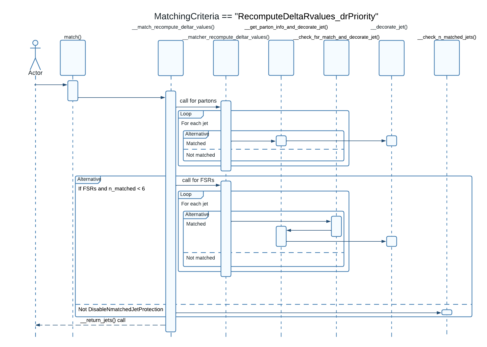

# <div align='center'>JetParton matcher for the ATLAS SUSY RPV Multijet analysis</div>

## Dependencies

- Python3.8+
- External python modules: ROOT

## How does it work?

The ```RPVMatcher``` class matches jets to last quarks in the gluino decay chain (and optionally FSRs).

**NOTES:**

- Jets must have been selected already (any kinematic/quality cut or of any other kind must have been applied already).
- When FSRs are provided, first jets are tried to be matched to the particles provided as partons, then non-matched jets are tried to be matched to FSRs not associated to already matched particles.
- The matching procedure is decided through the ```MatchingCriteria``` property which states if DeltaR values are recomputed or if FT decisions are used instead.

### Inputs:

Three types of inputs are supported:

- Jets: jets are provided as a list of ```RPVJet``` objects
- Last quarks in the gluino decay chain are provided as a list of ```RPVParton``` objects
- FSRs are provided as a list of ```RPVParton``` objects

Inputs can be provided during initialization:

```
matcher = RPVMatcher(Jets = selected_jets, Partons = partons, [FSRs = fsrs])
```

or can be added using the appropriate methods:

```
add_jets(self, jets: [RPVJet])
add_partons(self, partons: [RPVParton])
add_fsrs(self, fsrs: [RPVParton])
```

### Properties:

The following properties can be set through the ```set_property()``` method:

- ```"ReturnOnlyMatched"``` (value type: ```bool```): set to ```True``` to return only matched jets (```False``` by default)
- ```"MatchingCriteria"``` (value type: ```str```): there are currently three options: ```'UseFTDeltaRvalues'```, ```'RecomputeDeltaRvalues_drPriority'``` and ```'RecomputeDeltaRvalues_ptPriority'``` (```RecomputeDeltaRvalues_drPriority``` by default):
  - ```'RecomputeDeltaRvalues_drPriority'```: When using FSRs, if two jet-FSR pairs are associated to the same last quark in chain, the jet-FSR pair with lowest DeltaR value is chosen
  - ```'RecomputeDeltaRvalues_ptPriority'```: When using FSRs, if two jet-FSR paris are associated to the same last quark in chain, the jet-FSR pair having the largest jet pt is chosen
- ```"DeltaRcut"``` (value type: ```float```): maximum DeltaR value cut used for matching jets to partons when ```'MatchingCriteria' == 'RecomputeDeltaRvalues'``` (```0.4``` by default)
- ```"Debug"``` (value type: ```bool```): enable higher verbosity (```False``` by default)

### How to prepare jets?

A ```list``` of ```RPVJet``` objects must be created. Each jet (instance of ```RPVJet```) must call ```SetPtEtaPhiE()``` to set the jet's kinematics.

In addition, if ```"MatchingCriteria"``` is set to ```"UseFTDeltaRvalues"``` the corresponding methods need to be called (```set_matched_parton_barcode()``` for partons and ```set_matched_fsr_barcode()``` for FSRs).

### How to prepare partons (last quark in the gluino decay chain)?

A ```list``` of ```RPVParton``` objects must be created. Each parton (instance of ```RPVParton```) must call ```SetPtEtaPhiE()``` to set the parton's kinematics.

In addition, if ```"MatchingCriteria"``` is set to ```"UseFTDeltaRvalues"``` the following methods need to be called:

```
set_gluino_barcode()
set_barcode()
set_pdgid()
```
### How to prepare FSRs?

A ```list``` of ```RPVParton``` objects must be created. Each FSR (instance of ```RPVParton```) must call ```SetPtEtaPhiE()``` to set the FSR's kinematics.

In addition, if ```"MatchingCriteria"``` is set to ```"UseFTDeltaRvalues"``` the following methods need to be called:

```
set_quark_barcode() # barcode of corresponding parton from the same gluino decay chain
set_gluino_barcode()
set_barcode()
set_pdgid()
```
### How to run?

Run the ```match()``` method of ```RPVMatcher``` which will retrieve jets decorated with all the relevant information.

The following methods can be called after jets are matched:

```
is_matched()
get_match_type() # will return "Parton" or "FSR" if matched and "None" if not
get_match_barcode()
get_match_parton_index()
get_match_pdgid()
get_match_barcode()
get_match_gluino_barcode()
```
## Example

An example can be found in the repository as example.py

## UML Sequence Diagram for the case ```MatchingCriteria == 'RecomputeDeltaRvalues_drPriority'```


